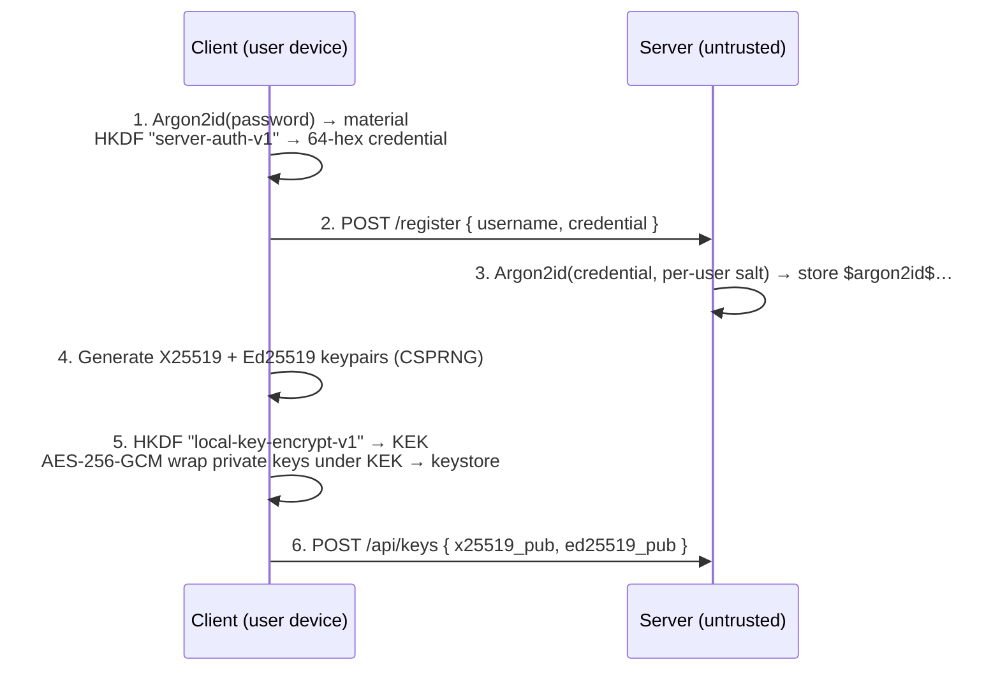
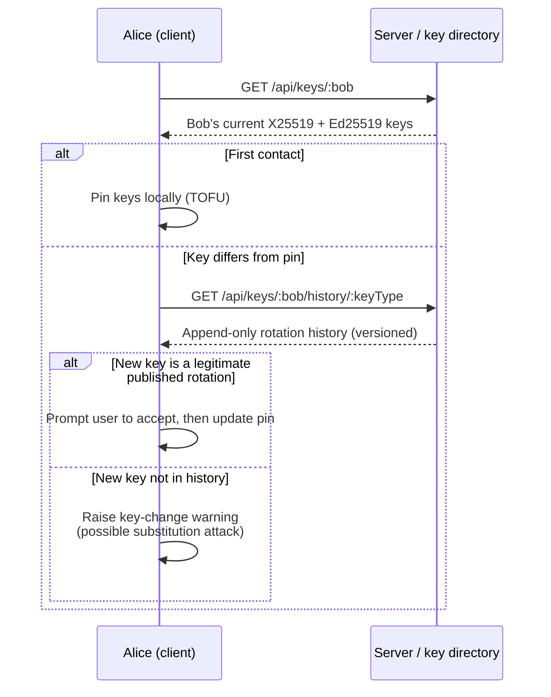
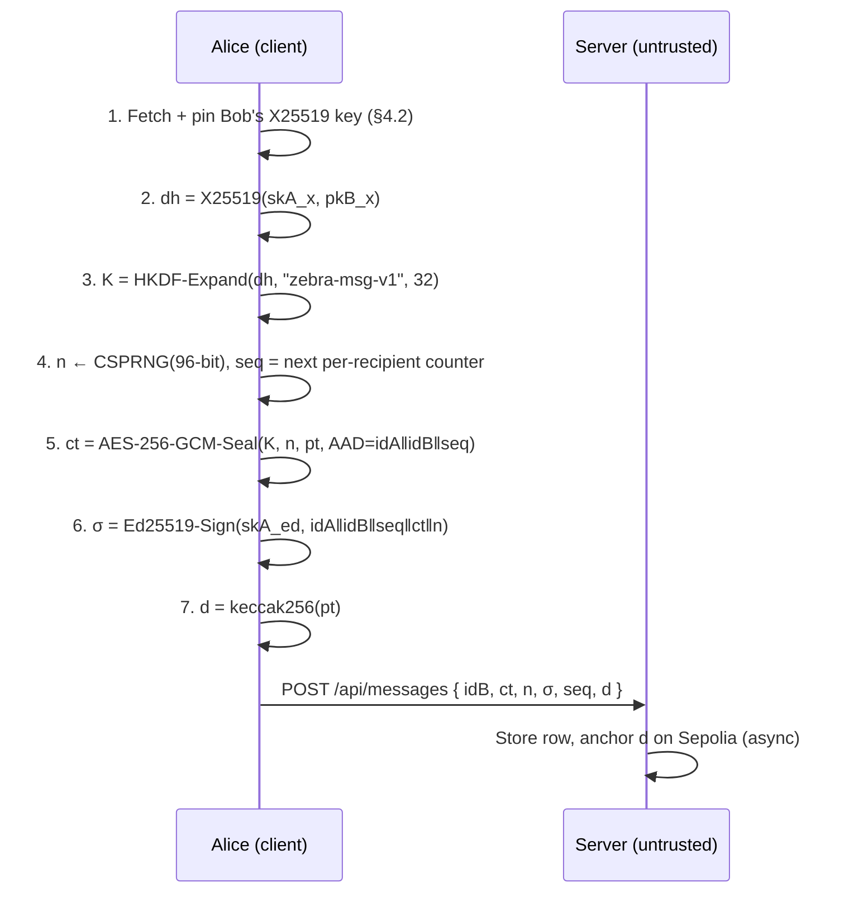
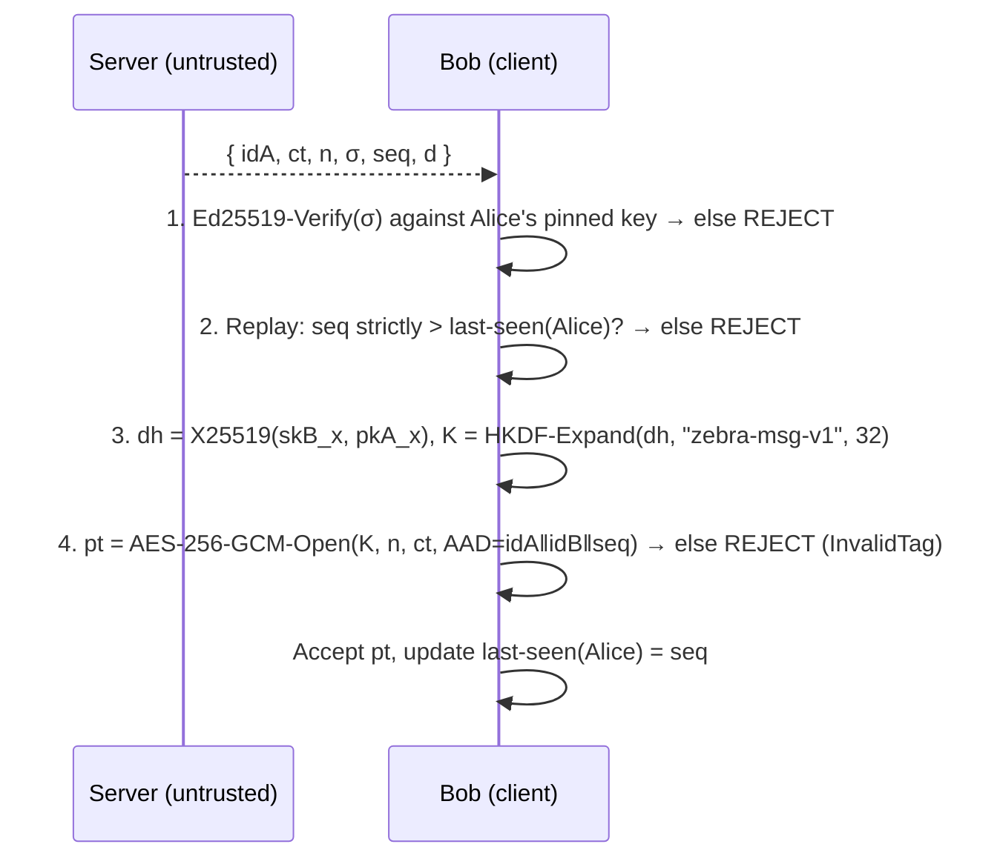
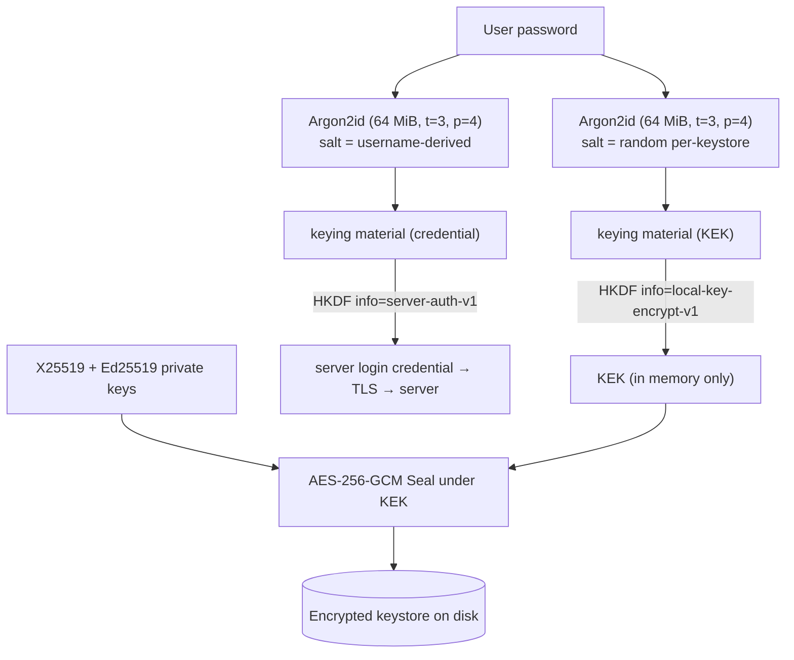

# Cryptographic Design Document
### Secure Messaging Application — Group *Zebra*

**Group:** Zebra · Harry Kikkers and Rafael Junior Okafor\
**Date:** June 2026

---

## 1. Scope and system overview

Zebra is an end-to-end encrypted messaging application. A user runs a local client (Python desktop app; a C++ utility maintains an encrypted local archive) that performs **all** cryptographic operations in-process. A Node.js/Express server backed by MySQL acts only as an untrusted relay and public-key directory: it stores and forwards ciphertext, but never holds any key capable of reading message content. Transport between client and server is protected by TLS 1.2/1.3 terminated at an nginx reverse proxy; the end-to-end (E2E) layer described here sits *underneath* TLS and does not depend on it for confidentiality of message content.

Each user holds **two independent long-term keypairs**, generated client-side and never shared in private form:

| Keypair | Curve / scheme | Purpose |
|---|---|---|
| X25519 | Curve25519 ECDH (RFC 7748) | Key agreement (deriving the per-conversation message key) |
| Ed25519 | EdDSA over edwards25519 (RFC 8032) | Sender authentication (signing each message) |

Keeping confidentiality (X25519) and authentication (Ed25519) on separate keys is a deliberate domain-separation choice: it prevents any cross-protocol interaction between the key-agreement and signing roles, and lets each be reasoned about, rotated, or revoked independently.

**The construction, in symbols.** For a message from Alice (A) to Bob (B) with per-recipient sequence number `seq`:

```
K   = HKDF-Expand( X25519(skA_x, pkB_x), info = "zebra-msg-v1", L = 32 )
AAD = idA ‖ idB ‖ seq
n   ← CSPRNG (96-bit)
ct  = AES-256-GCM-Seal( K, n, plaintext, AAD )
σ   = Ed25519-Sign( skA_ed, idA ‖ idB ‖ seq ‖ ct ‖ n )
d   = keccak256( plaintext )      // anchored on-chain, separate subsystem
```

The server receives only `(idB, ct, n, σ, seq, d)`. It can read none of the plaintext and can alter nothing without invalidating `σ`.

This is an **equivalent justified construction** in the sense of the brief (HPKE Mode_Auth *or equivalent*): it reuses HPKE's DHKEM-style X25519 agreement and HKDF/AEAD building blocks, but replaces HPKE's implicit authentication and ephemeral KEM with an explicit Ed25519 signature over a static-DH channel. Section 5 maps exactly what is retained, simplified, and omitted relative to RFC 9180.

---

## 2. Threat model

We analyse four attacker classes. For each we state which security properties hold. The properties under consideration are: **content confidentiality** (the attacker cannot read plaintext), **integrity / tamper-evidence** (undetected modification is infeasible), **sender authenticity** (messages provably originate from the claimed sender), **metadata privacy** (who-talks-to-whom, timing, sizes), and **forward secrecy** (compromise of long-term keys does not expose past messages).

### 2.1 Passive network attacker (eavesdrops the wire)

| Property | Holds? | Basis |
|---|---|---|
| Content confidentiality | ✅ | TLS on the wire; E2E AES-256-GCM beneath it (defence in depth) |
| Integrity / sender auth | ✅ | TLS record MAC; Ed25519 beneath it |
| Metadata privacy | ✅ (on-wire) | TLS hides application data; only coarse traffic analysis (record sizes/timing) remains |
| Forward secrecy | — | Not relevant to a pure eavesdropper; see §2.4 |

A passive attacker who could strip TLS would still see only ciphertext and signatures (never plaintext), but would gain message metadata. TLS is therefore the primary defence here and the E2E layer is the backstop.

### 2.2 Active network attacker (man-in-the-middle on the wire)

| Property | Holds? | Basis |
|---|---|---|
| Content confidentiality | ✅ | TLS server-certificate verification (client checks chain, hostname/SAN, validity) prevents wire MITM; E2E confidentiality independent of TLS |
| Integrity / tamper-evidence | ✅ | Any modification of `ct`, `n`, `seq`, or sender/recipient identity breaks the Ed25519 signature, which the recipient verifies against the *pinned* sender key |
| Sender authenticity | ✅ | As above |
| Metadata privacy | ✅ (on-wire) | Protected by TLS |
| First-contact key authenticity | ⚠️ | See §2.4 — an attacker who controls *key delivery at first contact* can substitute a key (TOFU bootstrap problem). On the wire, post-TLS, the attacker does not control key delivery. |

### 2.3 Honest-but-curious server (follows the protocol, reads everything it stores)

| Property | Holds? | Basis |
|---|---|---|
| Content confidentiality | ✅ | The server stores only `ct, n, σ, seq, d`. The message key `K` derives from X25519 private keys the server never possesses. Confidentiality is demonstrable directly from the `messages` table at the demo. |
| Integrity / sender auth | ✅ | Ed25519 signatures verified client-side |
| **Metadata privacy** | ❌ | The server necessarily learns sender, recipient, timing, message sizes, sequence numbers, and the full social graph. This is **not** protected. |
| Forward secrecy | ❌ | The server archives ciphertext indefinitely; see §2.4 |

### 2.4 Fully compromised server (controls relay, database, *and* the key directory)

This is the strongest adversary the brief mentions. The server can serve malicious public keys, drop / reorder / inject / delay messages, and read or retain everything in its database.

**Properties that still hold:**

- **Content confidentiality and integrity of already-pinned conversations.** Once Bob's X25519 and Ed25519 keys are pinned in Alice's client (Trust-On-First-Use), the server cannot read or undetectably modify subsequent Alice→Bob traffic: it has neither party's private X25519 key (these never leave the client and are encrypted at rest — §4.5), and it cannot forge Ed25519 signatures.
- **Sender authentication.** Same basis.
- **Detection of key substitution *after* pinning.** The server cannot silently swap a pinned key. The key-publication API refuses unacknowledged rotation, and the client reconciles any observed key against an append-only key-history endpoint; a key that is not a legitimate published rotation raises a key-change warning to the user (§4.2).

**Properties that do NOT hold under a fully compromised server (stated explicitly, as required):**

1. **Forward secrecy — absent by design.** Key agreement is *static*: every Alice→Bob message uses the same shared secret `X25519(skA_x, pkB_x)`. A future compromise of either long-term X25519 private key (e.g. via a later client compromise) retroactively decrypts **all** past messages between that pair — and all future ones. Because a malicious server can archive every ciphertext it relays, this turns a one-time future key leak into bulk historical disclosure. This is the most significant limitation of the design (see §6).
2. **First-contact key authenticity (TOFU bootstrap).** If the server is malicious *at the moment of first contact*, before any key is pinned, it can serve its own X25519/Ed25519 keys and mount an undetectable man-in-the-middle on that conversation. TOFU protects continuity *after* pinning, not the initial trust decision. Out-of-band fingerprint verification would close this gap and is noted as future work.
3. **Metadata privacy.** Sender, recipient, timing, sizes, and the social graph are visible to the server. Not protected.
4. **Availability / delivery integrity.** A malicious relay can censor, drop, delay, or reorder messages. No protocol property prevents this. The client's per-sender sequence-number check (§4.4) makes *replay and reordering detectable on receipt*, but cannot force delivery.

A concise restatement: **confidentiality, integrity, and sender authenticity survive full server compromise for pinned conversations; forward secrecy, first-contact authenticity, metadata privacy, and availability do not.**

---

## 3. Cryptographic primitives and parameter justification

Every primitive below is from a vetted library — `cryptography` (X25519, Ed25519, AES-256-GCM, HKDF-SHA256), `argon2-cffi` (Argon2id), and `pycryptodome` (keccak256) on the client; OpenSSL EVP for the C++ archive. No primitive is hand-rolled. All randomness (nonces, salts, keys) is drawn from the operating-system CSPRNG (`os.urandom` / the library's `secrets`-backed generators; `RAND_bytes` in the C++ component), satisfying the CSPRNG requirement.

### 3.1 Argon2id — password hashing and key-encryption-key derivation

**Algorithm.** Argon2id (RFC 9106), the hybrid variant that combines Argon2i's side-channel resistance on the first pass with Argon2d's GPU/ASIC resistance thereafter. Chosen over PBKDF2/bcrypt because it is *memory-hard*: an attacker's cost scales with memory × time, neutralising the parallelism advantage of GPUs and custom hardware.

**Two independent uses, same Argon2 cost, domain-separated** (§4.5):

| Use | Where | Parameters | Justification |
|---|---|---|---|
| Server-side verification of the login credential | `PasswordHasher.js` | `m = 64 MiB, t = 3, p = 4` | This is exactly the **second RECOMMENDED configuration in RFC 9106 §4**. The first option (2 GiB, t=1) is inappropriate for a server handling concurrent logins — 2 GiB per hash would exhaust memory under load — so the lower-memory recommended option is the correct choice for this deployment. |
| Client-side derivation of the local key-encryption key (KEK) | `kdf.py` | `m = 64 MiB, t = 3, p = 4` | The same RFC 9106 §4 second-RECOMMENDED cost as the server. Re-using the high cost here is deliberate, not an oversight: this parameter set *is* the brute-force cost an attacker pays against a **stolen, locked keystore**, so a higher cost strengthens at-rest protection. Lowering it to the interactive-unlock minimum would only weaken that resistance. |

Both uses run Argon2id at the same cost, but they are **domain-separated** so the requirement that at-rest key protection be *separate* from server-side password verification is met by construction. The separation is achieved by two independent means, neither of which depends on the Argon2 cost:

- **Distinct salts.** The KEK uses a random per-keystore salt (`os.urandom(16)`, stored in the keystore); the server credential uses a deterministic username-derived salt. Different salts make the two Argon2 outputs unrelated even before HKDF.
- **Distinct HKDF `info` strings** (§3.2): `local-key-encrypt-v1` for the KEK, `server-auth-v1` for the credential.

Consequently the value the server stores and the key that wraps the on-disk private keys are cryptographically independent — a breach of one reveals nothing about the other. The degenerate failure this requirement guards against (KEK *equal to* the transmitted credential) cannot occur here, because the salts and the `info` strings both differ.

> _Implementation note: these are the source-of-truth constants in `PasswordHasher.js` / `backend/.env.example` (server) and `kdf.py` (client KEK); the table reflects them exactly._

### 3.2 HKDF-SHA256 — key derivation and domain separation

**Algorithm.** HKDF (RFC 5869), Extract-then-Expand, with SHA-256. Used in two places: (a) to expand the static X25519 shared secret into the 32-byte AES-256-GCM message key, and (b) to derive the local KEK and the server-auth credential from the password-derived material.

**Domain separation (RFC 5869 §3.2).** Every HKDF use carries a distinct `info` string so that the same input keying material can never yield colliding outputs across purposes:

- `"zebra-msg-v1"` → message-encryption key
- `"local-key-encrypt-v1"` → local KEK (wraps private keys at rest)
- `"server-auth-v1"` → server login credential (with a username-derived salt)

This guarantees, for example, that the credential transmitted to the server is cryptographically unrelated to the key that protects the private keys on disk — a leak of one reveals nothing about the other. The message-key derivation (§3.3) uses **HKDF-Expand directly** on the X25519 shared secret with no Extract step and no salt: RFC 5869 §3.1 permits omitting Extract when the input keying material is already uniformly random, which a Curve25519 DH output is, so the `info` string alone carries the domain separation. The KEK and server-credential derivations differ instead in their Argon2 *salt* (random per-keystore vs. username-derived), as described in §3.1.

### 3.3 X25519 — key agreement

**Algorithm.** X25519 Diffie-Hellman over Curve25519 (RFC 7748 §5). Provides ≈128-bit security with a misuse-resistant, constant-time-friendly fixed-base/variable-base interface and no invalid-curve pitfalls. The shared secret is computed as `X25519(skA_x, pkB_x)`, which by the symmetry of DH equals `X25519(skB_x, pkA_x)` (RFC 7748 §6.1), so sender and recipient derive an identical secret from their long-term keys with nothing extra on the wire.

**Security property relied upon:** computational Diffie-Hellman / the hardness of the discrete log on Curve25519. **Known consequence of the static choice:** no forward secrecy (§2.4, §6).

### 3.4 Ed25519 — sender authentication

**Algorithm.** Ed25519 (RFC 8032 §5.1), deterministic EdDSA over edwards25519, ≈128-bit security. Each message carries a detached signature over `idA ‖ idB ‖ seq ‖ ct ‖ n`. Because the signature covers the sender and recipient identities, the sequence number, the ciphertext, **and** the nonce, any tampering with the routing metadata, ordering, ciphertext, or IV is detected before decryption is attempted. Ed25519 is chosen over ECDSA for its determinism (no per-signature randomness to leak a private key) and constant-time implementations.

**Security property relied upon:** EUF-CMA unforgeability. Authentication is *explicit and detached* rather than folded into the KEM (see §5), giving clear non-repudiation and decoupling the authentication trust from the confidentiality channel.

### 3.5 AES-256-GCM — authenticated encryption

**Algorithm.** AES-256 in Galois/Counter Mode (NIST SP 800-38D), an AEAD providing confidentiality and integrity in one pass; an approved AEAD for HPKE. The brief forbids non-AEAD schemes, Encrypt-and-MAC, and MAC-then-Encrypt — GCM is a true AEAD and avoids all three.

**Nonce strategy and the static-key consequence.** Nonces are 96-bit, drawn fresh from the CSPRNG per message (SP 800-38D §8.2.2, the RBG-based IV construction). This is the single most safety-critical parameter in the design, because the message key is **static per (sender, recipient) pair**: the key is *not* rotated per message, so GCM's security rests entirely on never repeating a `(key, nonce)` pair. With random 96-bit nonces under one key, the birthday bound gives a negligible collision probability up to on the order of 2³² messages per conversation (SP 800-38D's stated limit for random IVs) — far beyond any realistic conversation volume for this application. A repeated `(key, nonce)` pair would be catastrophic (it leaks the XOR of plaintexts and enables forgery via the GHASH authentication key), which is precisely why nonces come from the CSPRNG and never from a counter that could reset. The associated data `AAD = idA ‖ idB ‖ seq` binds each ciphertext to its routing metadata and sequence position inside the GCM tag, so the server cannot redirect or reorder a ciphertext without detection.

### 3.6 keccak256 — on-chain message digest

**Algorithm.** keccak256 as defined by the Ethereum Yellow Paper (the original Keccak permutation, **not** NIST FIPS 202 SHA3-256 — the two differ in their padding rule; this distinction matters because an SHA3-256 implementation would produce a non-matching digest). The client computes `keccak256(plaintext)` and the server anchors it on the Ethereum Sepolia testnet, providing tamper-evident, timestamped integrity proof independent of the messaging server. Collision and pre-image resistance at the 256-bit output give ≈128-bit collision security. This subsystem is integrity-only; it carries no confidentiality role and no plaintext leaves the client (only the digest is published). The on-chain record is keyed by the message's unique identifier, **not** by the digest value, so two messages whose plaintexts are identical (e.g. "ok") each anchor as their own timestamped transaction rather than the second colliding with the first; re-recording the same message is idempotent. This keeps the digest a pure function of the plaintext — the verification page recomputes `keccak256(plaintext)` from the content alone — while still letting every message be recorded.

---

## 4. Construction walkthrough

> The diagrams below are Mermaid and render in GitHub's repository view. Each is accompanied by numbered prose so the flow is complete even where Mermaid is not rendered.

### 4.1 Registration and key generation

Registration establishes a server login credential; key generation happens client-side when the local keystore is first created (on first login), and the public keys are published immediately afterward. Private keys never leave the device.



1. The client derives a 64-hex login credential from the password (Argon2id, then HKDF with `info = "server-auth-v1"`). The cleartext password never leaves the device; the credential is password-equivalent *in transit* and is protected by TLS.
2. The credential — not the password — is sent to the server.
3. The server re-hashes the received credential with Argon2id and its own per-user random salt before storage, so a database leak yields neither the password nor a value replayable against `/login`.
4. The client generates both long-term keypairs from the CSPRNG.
5. A separate HKDF derivation (`info = "local-key-encrypt-v1"`) yields the KEK, under which the private keys are sealed with AES-256-GCM into the local keystore (§4.5).
6. Only the **public** keys are published to the directory.

### 4.2 Key publication, lookup, and trust model (TOFU + pinning)

The trust model is **Trust-On-First-Use with pinning**, hardened against a malicious directory. On first contact with a peer the client pins their published X25519 and Ed25519 keys. On every subsequent interaction it re-checks the served key against the pin:



Two server-side properties make post-pin substitution detectable: the publication endpoint **refuses unacknowledged key rotation** (a rotation must be explicitly acknowledged, so the server cannot silently overwrite a key), and rotations are recorded in an **append-only, versioned history** that clients reconcile against. The residual gap is the first-contact decision itself (§2.4, §6): TOFU cannot authenticate a key it has never seen before.

### 4.3 Sending a message



Steps follow the symbolic construction of §1. The per-recipient sequence counter is monotonic and persisted in the keystore, so it survives restarts and cannot silently reset.

### 4.4 Receiving a message

Verification runs **four checks in a fixed order**, and plaintext is produced only if all four pass:



1. **Signature first.** Verifying Ed25519 before doing any key agreement or decryption means a forged or tampered message is discarded cheaply, without spending an ECDH operation — good for both correctness and denial-of-service resistance.
2. **Replay / ordering.** The sequence number must be strictly greater than the highest previously accepted value from this sender; otherwise the message is a replay or is out of order and is rejected. This client-side check is the authoritative replay defence.
3. **Agreement and derivation.** Bob recomputes the identical static shared secret and message key.
4. **AEAD open.** GCM verifies the tag over `ct` and the AAD before releasing plaintext; a wrong key, altered ciphertext, or altered metadata yields `InvalidTag` and a rejection.

As a transport-layer backstop, the server independently enforces a `UNIQUE(recipient_id, nonce)` constraint, rejecting a duplicate ciphertext at insert time. This is defence-in-depth only; a fully compromised server could bypass its own constraint, which is why the client's sequence check is the property we rely on.

### 4.5 Storage at rest

Long-term private keys are never stored in the clear. They are sealed under a KEK that is derived from the user's password and exists only in memory while the keystore is unlocked:



A password change re-derives the KEK and re-wraps the private-key blob, so keys remain accessible without ever being written in the clear. Because the KEK derivation uses a different salt and a different HKDF `info` string from the server credential (§3.1), an attacker who steals the on-disk keystore gains nothing usable without the password, and the value the server stores is cryptographically unrelated to the KEK. This satisfies the requirement that locally stored private keys be encrypted at rest under a separately derived key — a stolen, locked device does not yield the private keys.

---

## 5. Relationship to HPKE (retained / simplified / omitted)

The brief names HPKE Mode_Auth (RFC 9180) as the reference and accepts an *equivalent justified construction*. Ours is equivalent in its building blocks but makes two deliberate substitutions. Stated explicitly, as required:

**Retained from HPKE/RFC 9180:**
- DHKEM-style key agreement over X25519 (RFC 9180 §4.1 computes a shared secret from `DH(skX, pkY)`), here used directly as the static-DH output.
- HKDF-SHA256 as the key-derivation function.
- An approved AEAD — AES-256-GCM (RFC 9180 §7.3 lists AES-256-GCM among HPKE's AEADs).

**Simplified:**
- HPKE's full key schedule (RFC 9180 §5.1 — `psk_id`, `info`, exporter secrets, and separate key/base-nonce/exporter derivations) is reduced to a single `HKDF-Expand` with one domain-separation `info` string producing the AEAD key. We do not use HPKE's exporter interface or sequence-based base-nonce; nonces are independent random values (§3.5).

**Omitted:**
- **The ephemeral KEM keypair.** HPKE's `Encap` (RFC 9180 §4.1) generates a fresh ephemeral keypair per encryption and ships the encapsulated public key (`enc`) on the wire, which is what provides forward secrecy. We use the sender's **static** X25519 key instead, so there is no `enc` on the wire and **no forward secrecy** (§2.4, §6).
- **HPKE Mode_Auth's implicit sender authentication.** Mode_Auth (RFC 9180 §5.1.4) folds the sender's static private key into the key schedule so that successful decryption implies sender identity. We instead authenticate **explicitly** with a detached Ed25519 signature. This is a stronger, clearer form of authentication for our purposes: it gives non-repudiation, it authenticates the routing metadata and nonce as well as the ciphertext, and it keeps the authentication trust (Ed25519 key) cleanly separated from the confidentiality channel (X25519 key).

The net effect is a static-DH confidentiality channel with explicit signature authentication — comparable to the long-term component of a static-static DH design, augmented with per-message signatures and replay-protected AAD.

---

## 6. Known limitations

Stated honestly, as the rubric requires. None of these is hidden in the implementation; each is a consequence of a deliberate scoping decision.

1. **No forward secrecy.** The dominant limitation. Static key agreement means a single future compromise of a long-term X25519 key exposes all past and future messages with that peer, and a server that archives ciphertext can exploit this in bulk. Mitigation would require an ephemeral/ratcheting layer (HPKE with ephemeral KEM, or a Double-Ratchet-style design); this was scoped out to keep the construction simple enough to implement and defend correctly within the project's time budget.
2. **TOFU first-contact trust.** The initial key-pinning decision is unauthenticated; a server malicious at first contact can MITM a new conversation undetectably. Out-of-band fingerprint comparison would close this and is the natural next step.
3. **No metadata protection.** Sender, recipient, timing, sizes, and the social graph are visible to the server. Metadata privacy was out of scope.
4. **No post-quantum resistance.** X25519 and Ed25519 rely on the hardness of the elliptic-curve discrete-log problem, which a sufficiently large quantum computer would break (Shor's algorithm). A "harvest-now, decrypt-later" adversary recording today's ciphertext could decrypt it in a post-quantum future. A hybrid X25519+ML-KEM agreement would address this; it was out of scope.
5. **Server-side sequence monotonicity is not enforced.** Replay/ordering is enforced by the *client* on receive (§4.4); the server checks only `(recipient_id, nonce)` uniqueness. We rely on the client-side check and treat the server constraint as a backstop only — appropriate given the server is untrusted, but worth stating.
6. **Per-message on-chain anchoring.** Each message currently produces one Sepolia transaction. For higher volumes, batching message digests under a Merkle root per transaction would reduce gas cost; per-message anchoring was chosen for demonstration clarity at this scale.

---

## 7. References

- **RFC 9106** — *Argon2 Memory-Hard Function for Password Hashing and Proof-of-Work Applications.* §4 (parameter recommendations).
- **RFC 5869** — *HMAC-based Extract-and-Expand Key Derivation Function (HKDF).* §2 (Extract/Expand), §3.1 (salt), §3.2 (info).
- **RFC 7748** — *Elliptic Curves for Security.* §5 (X25519), §6.1 (Diffie-Hellman).
- **RFC 8032** — *Edwards-Curve Digital Signature Algorithm (EdDSA).* §5.1 (Ed25519).
- **NIST SP 800-38D** — *Recommendation for Block Cipher Modes of Operation: GCM and GMAC.* §8.2 (IV construction), §8.3 (uniqueness/limits).
- **RFC 9180** — *Hybrid Public Key Encryption (HPKE).* §4.1 (DHKEM), §5.1 (key schedule / modes), §7.3 (AEAD identifiers).
- **OWASP** — *Password Storage Cheat Sheet* (Argon2id parameter guidance).
- **Ethereum Yellow Paper** — definition of keccak256 (distinct from FIPS 202 SHA3-256).
