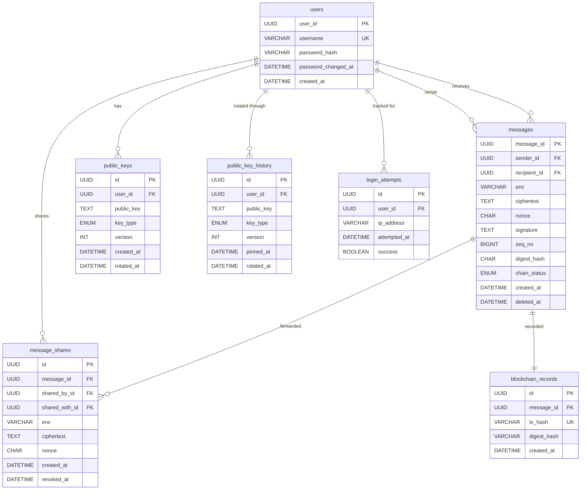

# Secure Messenger — Server

Backend server for the CS4455 Epic Project secure messaging application.

## Tech Stack

- **Runtime**: Node.js + Express
- **Database**: MySQL 8
- **Auth**: Argon2id password hashing, JWT sessions
- **Blockchain**: ethers.js → Ethereum Sepolia testnet
- **Security**: Helmet, CORS, rate limiting, input validation

## Backend Flow

Routes \
  ↓
Middleware \
  ↓
Controllers \
  ↓
Services \
  ↓
Repositories \
  ↓
Database / external systems 

## Project Structure

```
backend/
├── src/
│   ├── app.js                  # Entry point — wires repos + services, starts the server
│   ├── config/
│   │   ├── index.js            # Environment config (single source of truth)
│   │   └── database.js         # MySQL connection pool
│   ├── controllers/            # Thin HTTP handlers — parse request, call service, format response
│   │   ├── AuthController.js
│   │   ├── MessageController.js
│   │   └── KeyController.js
│   ├── middleware/
│   │   ├── auth.js             # JWT verification
│   │   ├── errorHandler.js     # Global error handler
│   │   ├── requestId.js        # Per-request UUID for log correlation
│   │   └── validate.js         # Input validation rules (express-validator)
│   ├── repositories/           # Data access layer — parameterised SQL, no business logic
│   │   ├── UserRepository.js
│   │   ├── MessageRepository.js
│   │   ├── KeyRepository.js
│   │   └── LoginAttemptRepository.js
│   ├── routes/                 # Route definitions — maps URLs to controller methods
│   │   ├── index.js            # Mounts all route groups
│   │   ├── auth.js
│   │   ├── messages.js
│   │   └── keys.js
│   ├── services/               # Business logic layer
│   │   ├── AuthService.js      # Registration, login, JWT
│   │   ├── MessageService.js   # Send, receive, forward, revoke
│   │   ├── BlockchainService.js# Sepolia digest recording
│   │   ├── KeyService.js       # Public key management (TOFU)
│   │   └── PasswordHasher.js   # Argon2id wrapper injected into AuthService
│   └── utils/
│       ├── logger.js           # Winston structured logging
│       └── errors.js           # Custom error hierarchy
├── scripts/
│   └── init-db.js              # Creates database tables
├── tests/                      # Jest test files
├── .env.example                # Environment variable template
├── .gitignore
├── package.json
└── README.md
```

## Setup

### Prerequisites

- Node.js 18+
- MySQL 8
- A `.env` file (copy from `.env.example`)

### Install and Run

```bash
# Clone and install dependencies
npm install

# Create the database
mysql -u root -e "CREATE DATABASE secure_messenger;"
mysql -u root -e "CREATE USER 'messenger'@'localhost' IDENTIFIED BY 'your_password';"
mysql -u root -e "GRANT ALL PRIVILEGES ON secure_messenger.* TO 'messenger'@'localhost';"

# Copy and edit environment config
cp .env.example .env
# Edit .env with your database credentials, JWT secret, etc.

# Initialise tables
npm run db:init

# Start the server (development with auto-reload)
npm run dev

# Start the server (production)
npm start
```

### API Endpoints

| Method | Path | Auth | Description |
|--------|------|------|-------------|
| POST | `/api/auth/register` | No | Create account |
| POST | `/api/auth/login` | No | Get JWT token |
| PUT | `/api/auth/password` | Yes | Change password — body: `{ currentPassword, newPassword }` |
| GET | `/api/auth/me` | Yes | Current user info |
| POST | `/api/messages` | Yes | Send encrypted message — body: `{ recipientId, enc, ciphertext, nonce, signature, seqNo, digest }` where `enc` is the HPKE encapsulated key, `signature` is the Ed25519 signature over the payload, `seqNo` is the per-recipient sequence number, and `digest` is the client-computed keccak256 of plaintext (0x + 64 hex) |
| GET | `/api/messages/inbox` | Yes | List received messages |
| GET | `/api/messages/sent` | Yes | List sent messages |
| GET | `/api/messages/:id` | Yes | Get single message |
| GET | `/api/messages/:id/chain` | Yes | Chain proof: `{ digestHash, chainStatus, txHash, recordedAt }` — feed `txHash` into the standalone verification page |
| POST | `/api/messages/:id/forward` | Yes | Forward to another user — body: `{ recipientId, enc, ciphertext, nonce }` (re-encrypted under the new recipient's key) |
| POST | `/api/messages/:id/revoke` | Yes | Revoke shared access |
| DELETE | `/api/messages/:id` | Yes | Soft-delete message |
| POST | `/api/keys` | Yes | Publish public key — body: `{ publicKey, keyType, acknowledgeRotation? }` |
| GET | `/api/keys` | Yes | List all public keys |
| GET | `/api/keys/:userId` | Yes | Get user's public key |
| GET | `/api/keys/:userId/history/:keyType` | Yes | Append-only key rotation history — clients reconcile pinned keys against this to detect server-side substitution |
| GET | `/api/health` | No | Health check |

### Blockchain integration

The server **does not** compute message digests. The client computes
`keccak256(plaintext)` before encrypting and sends the resulting 32-byte
hex string as the `digest` field of `POST /api/messages`. On `message:sent`,
`BlockchainService` writes that digest to the `MessageDigest` contract on
Sepolia via `contract.recordHash(digest)`, stores `(message_id, tx_hash,
digest_hash)` in `blockchain_records`, and flips `messages.chain_status`
to `recorded`.

The contract source is at [`contracts/src/MessageDigest.sol`](../contracts/src/MessageDigest.sol);
deployment instructions are at [`contracts/DEPLOY.md`](../contracts/DEPLOY.md);
the address + ABI live in [`contracts/deployments/sepolia.json`](../contracts/deployments/sepolia.json)
and are imported at runtime — there is no inline ABI in the JS.

The standalone verification page (separate from this API, per the brief)
takes plaintext + a `txHash` from `GET /api/messages/:id/chain`, recomputes
`keccak256(plaintext)` in the browser, fetches the on-chain
`HashRecorded` event for that tx, and compares.

## Database Schema



DDL lives in [scripts/init-db.js](scripts/init-db.js).

## Security Notes

- The server **never** sees plaintext messages — only ciphertext
- Passwords are hashed with Argon2id (OWASP-recommended parameters)
- All user input is validated and sanitised before processing
- Rate limiting on auth endpoints prevents brute-force attacks
- Helmet sets secure HTTP headers (HSTS, X-Frame-Options, etc.)
- SQL injection prevented via parameterised queries throughout
