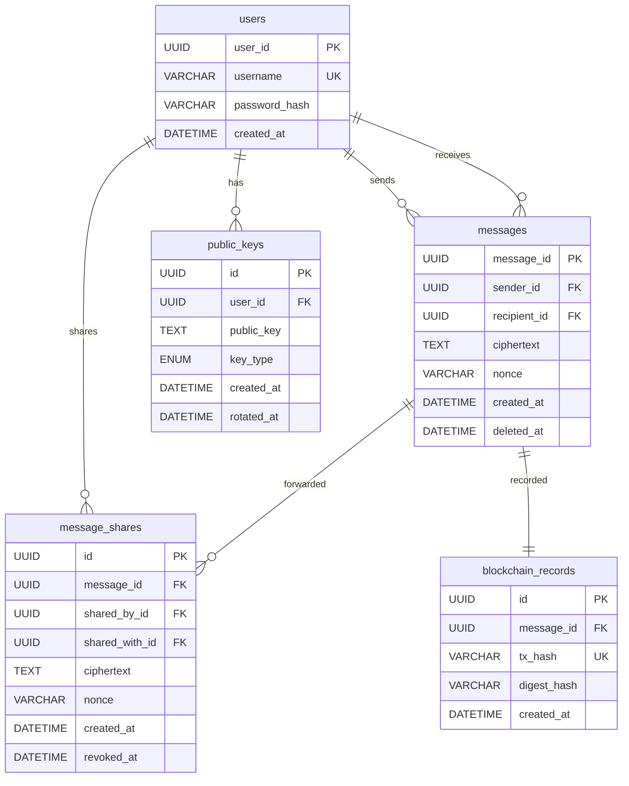

# Secure Messenger — Server

Backend server for the CS4455 Epic Project secure messaging application.

## Tech Stack

- **Runtime**: Node.js + Express
- **Database**: MySQL 8
- **Auth**: Argon2id password hashing, JWT sessions
- **Blockchain**: ethers.js → Ethereum Sepolia testnet
- **Security**: Helmet, CORS, rate limiting, input validation

## Design Patterns (GoF)

| Pattern | Where | Why |
|---------|-------|-----|
| **Singleton** | `database.js` — MySQL connection pool | Prevents duplicate pools; one shared instance |
| **Observer** | `EventBus.js` — event pub/sub | Decouples message sending from blockchain recording |
| **Strategy** | `HashStrategy.js` — Argon2id / Keccak256 | Same interface for different hashing algorithms |
| **Factory** | `ServiceFactory.js` — service creation | Centralises dependency wiring; simplifies testing |

## Project Structure

```
backend/
├── src/
│   ├── app.js                  # Entry point — composes and starts the server
│   ├── config/
│   │   ├── index.js            # Environment config (single source of truth)
│   │   └── database.js         # MySQL pool (Singleton)
│   ├── controllers/            # Thin HTTP handlers — parse request, call service, format response
│   │   ├── AuthController.js
│   │   ├── MessageController.js
│   │   ├── KeyController.js
│   │   └── BlockchainController.js
│   ├── middleware/
│   │   ├── auth.js             # JWT verification
│   │   ├── errorHandler.js     # Global error handler
│   │   └── validate.js         # Input validation rules (express-validator)
│   ├── repositories/           # Data access layer — raw SQL, no business logic
│   │   ├── UserRepository.js
│   │   ├── MessageRepository.js
│   │   └── KeyRepository.js
│   ├── routes/                 # Route definitions — maps URLs to controller methods
│   │   ├── index.js            # Mounts all route groups
│   │   ├── auth.js
│   │   ├── messages.js
│   │   ├── keys.js
│   │   └── blockchain.js
│   ├── services/               # Business logic layer
│   │   ├── AuthService.js      # Registration, login, JWT
│   │   ├── MessageService.js   # Send, receive, forward, revoke
│   │   ├── BlockchainService.js# Hash recording on Sepolia
│   │   └── KeyService.js       # Public key management (TOFU)
│   ├── patterns/
│   │   ├── observer/
│   │   │   └── EventBus.js     # GoF Observer — event pub/sub
│   │   ├── strategy/
│   │   │   └── HashStrategy.js # GoF Strategy — pluggable hashing
│   │   └── factory/
│   │       └── ServiceFactory.js # GoF Factory — dependency wiring
│   └── utils/
│       ├── logger.js           # Winston structured logging
│       └── errors.js           # Custom error hierarchy
├── scripts/
│   └── init-db.js              # Creates database tables
├── tests/                      # Jest test files
├── .env.example                # Environment variable template
├── .gitignore
├── package.json
└── README.md
```

## Setup

### Prerequisites

- Node.js 18+
- MySQL 8
- A `.env` file (copy from `.env.example`)

### Install and Run

```bash
# Clone and install dependencies
npm install

# Create the database
mysql -u root -e "CREATE DATABASE secure_messenger;"
mysql -u root -e "CREATE USER 'messenger'@'localhost' IDENTIFIED BY 'your_password';"
mysql -u root -e "GRANT ALL PRIVILEGES ON secure_messenger.* TO 'messenger'@'localhost';"

# Copy and edit environment config
cp .env.example .env
# Edit .env with your database credentials, JWT secret, etc.

# Initialise tables
npm run db:init

# Start the server (development with auto-reload)
npm run dev

# Start the server (production)
npm start
```

### API Endpoints

| Method | Path | Auth | Description |
|--------|------|------|-------------|
| POST | `/api/auth/register` | No | Create account |
| POST | `/api/auth/login` | No | Get JWT token |
| GET | `/api/auth/me` | Yes | Current user info |
| POST | `/api/messages` | Yes | Send encrypted message |
| GET | `/api/messages/inbox` | Yes | List received messages |
| GET | `/api/messages/sent` | Yes | List sent messages |
| GET | `/api/messages/:id` | Yes | Get single message |
| POST | `/api/messages/:id/forward` | Yes | Forward to another user |
| POST | `/api/messages/:id/revoke` | Yes | Revoke shared access |
| DELETE | `/api/messages/:id` | Yes | Soft-delete message |
| POST | `/api/keys` | Yes | Publish public key |
| GET | `/api/keys` | Yes | List all public keys |
| GET | `/api/keys/:userId` | Yes | Get user's public key |
| POST | `/api/blockchain/verify` | No | Verify message hash on-chain |
| GET | `/api/health` | No | Health check |

## Database Schema



DDL lives in [scripts/init-db.js](scripts/init-db.js).

## Security Notes

- The server **never** sees plaintext messages — only ciphertext
- Passwords are hashed with Argon2id (OWASP-recommended parameters)
- All user input is validated and sanitised before processing
- Rate limiting on auth endpoints prevents brute-force attacks
- Helmet sets secure HTTP headers (HSTS, X-Frame-Options, etc.)
- SQL injection prevented via parameterised queries throughout
